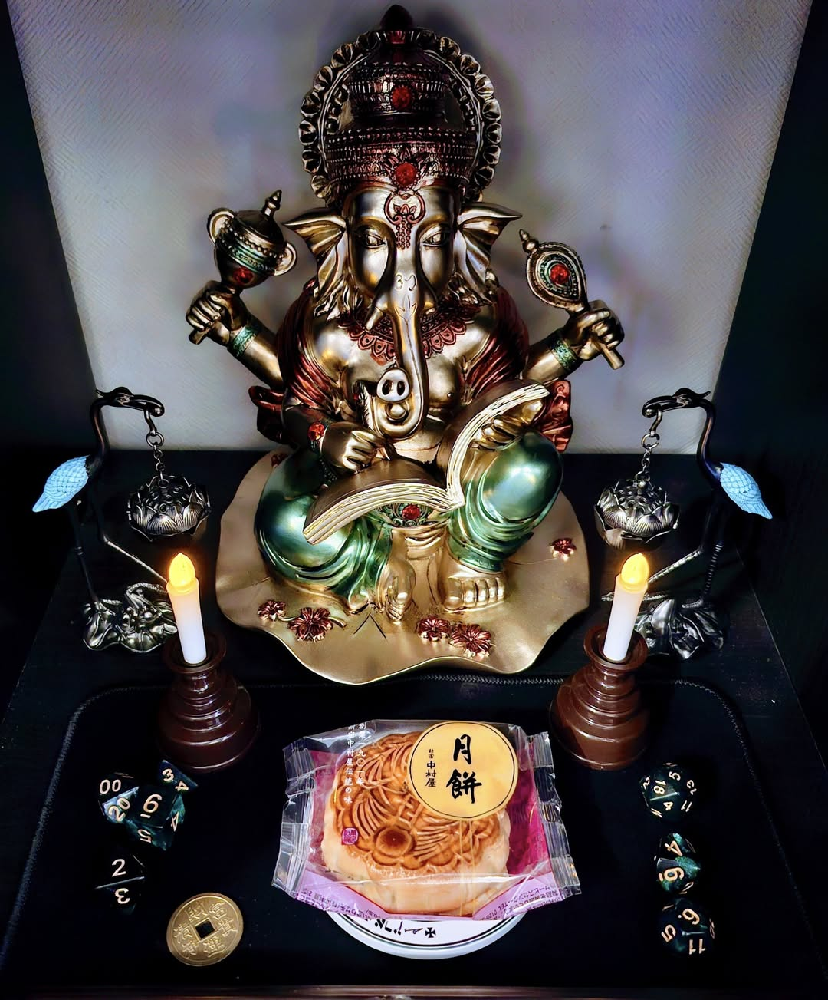

# 🐘 ガネーシャへの感謝の儀式

この儀式は、願望が成就したときにガネーシャ神に感謝を捧げるためのものです。  
日本人の「お礼参り」にも通じる自然な感覚を大切にしつつ、ガネーシャとの信頼関係を深め、魔術が実際に作用したことを確認・共有するものです。

---

## 🐘 用意するもの（いずれも可能な範囲で）

- ガネーシャ像または画像
- 甘い供物（以下のようなもの）：
  - ガネーシャが好むコルカッタイ（モーダカ）があれば最適
  - 歓喜天が好む「歓喜団」でもよい
  - または大福など甘いもの月餅、大福（苺大福、蓬大福）、ベルギーワッフル、バームクーヘンなど
- お香または電池式キャンドル（任意）

---

### 1. 静かに空間を整える（香・キャンドル点灯）

甘いものをガネーシャ像の前に置く

---

### 2. 真言の詠唱（3回）

英語・サンスクリット形式：
> Om Gaṃ Gaṇapataye Namaḥ ×3

日本語訳（声に出す場合の参考）：
> オーム・ガン・ガナパタイエ・ナマハ（障害を除く者よ、我はあなたに帰依します）

---

## 3. 成就の報告と感謝の言葉

（英語）
> Ganesha, remover of obstacles and bringer of wisdom,  
> through your blessings,  
> my wish has manifested in this world.
> I offer my deepest thanks.

（日本語）
> 障害を除き、智慧をもたらす神、ガネーシャ。  
> あなたの御加護により、  
> 私の願いは実現しました。  
> 心から感謝いたします。

---

### 4. IAOM（神聖な封印音、1回）

> **IAOM**

（深く、低く唱えて意図を安定させる）

---

### 5. 真言の詠唱（再度3回）

> Om Gaṃ Gaṇapataye Namaḥ ×3（再度）

---

### 6. 供物を捧げる

ガネーシャ像の前に置いた甘いものは、しばらくお供えした後にあとで感謝していただく

---

### 7. 感謝の一礼または黙想

心の中で深く感謝をして終了

---

## ✨ この儀式は、ガネーシャ神殿でお願いした願いが成就したときに使用します：

- ダイエットが成功した
- 良い仕事や依頼が来た
- 就職が決まった
- 資格試験に合格した
- プレゼンがうまくできた
- 安全に旅から戻った
- その他、あなた自身が「助けられた」と感じた時など

🕉️ ガネーシャは日常的な願いにも柔軟に応えてくれます。

---

## 🐌 メモ

この儀式は、Ravensgateにおける魔術の透明性と地産地消の思想に基づいています。  
形式よりも「感謝の意志」が最も重要であることを忘れずに。

---

© 2025 知られざる呪術師（Le Sorcier Inconnu）  
本ドキュメントは [Creative Commons BY-SA 4.0](https://creativecommons.org/licenses/by-sa/4.0/deed.ja) に基づき公開されています。
